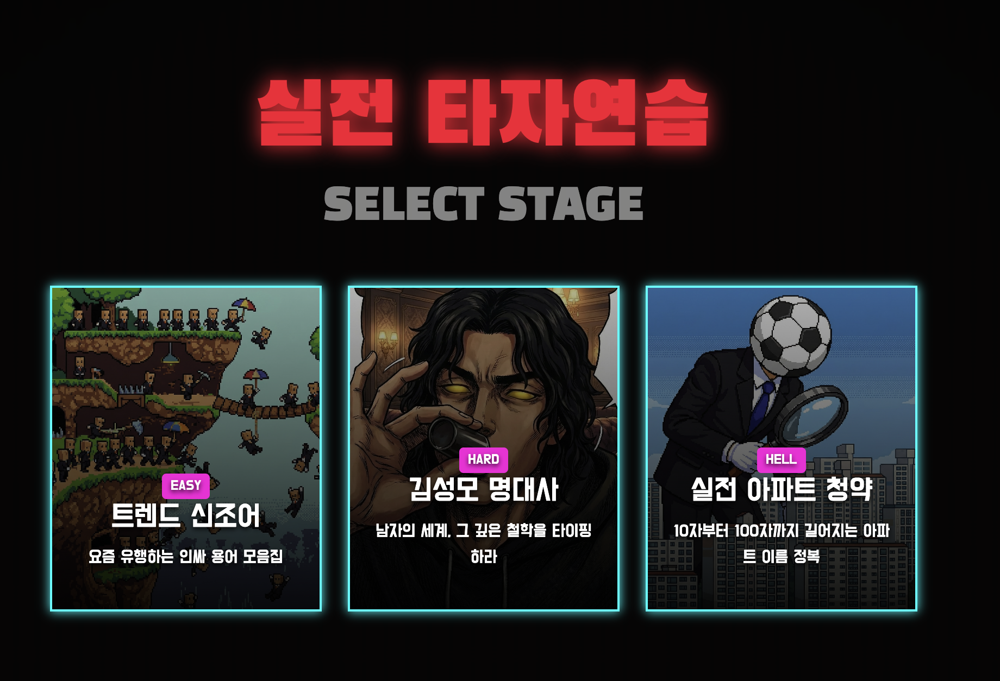
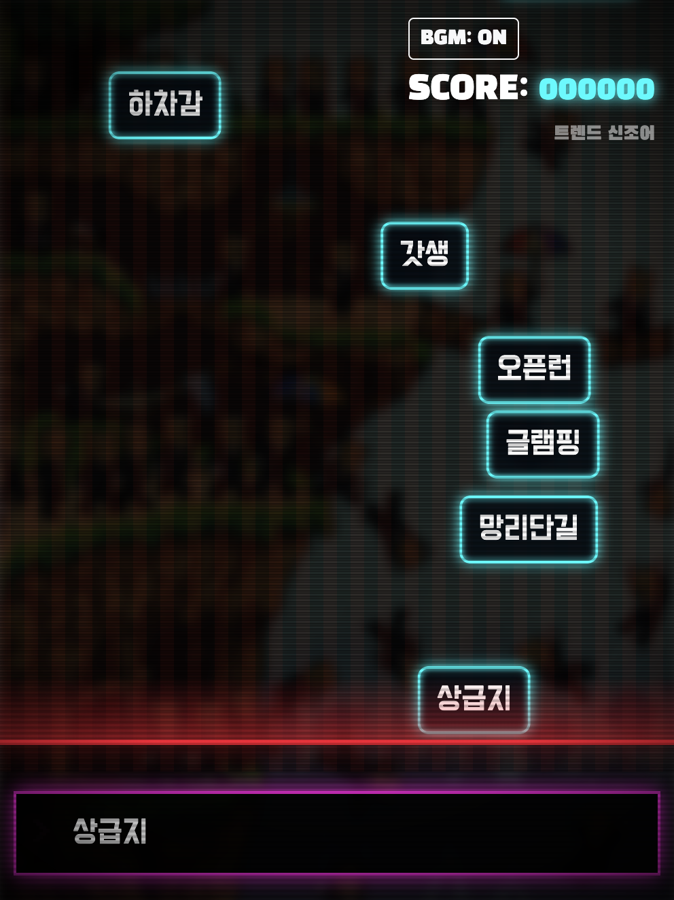
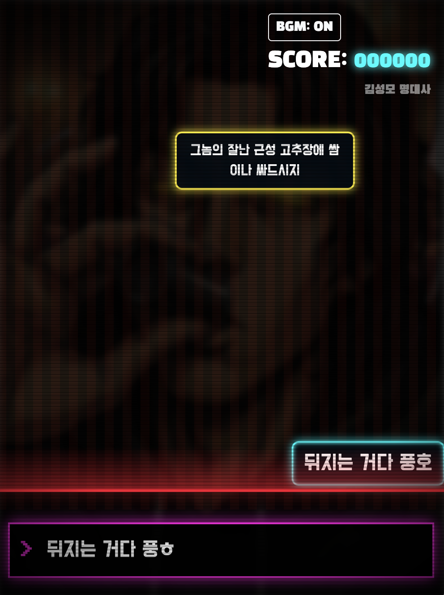

# 실전 타자연습 (Arcade Typing Practice)

**실전 타자연습**은 20세기 오락실 감성의 레트로 아케이드 타자 게임입니다. 단순한 타자 연습을 넘어, 다양한 테마와 물리 엔진이 적용된 긴장감 넘치는 플레이를 제공합니다.

## ✨ 프로젝트 개요

이 프로젝트는 **100% Client-Side** 기술로만 구현되었습니다.

- **서버 저장 없음**: 게임 기록과 데이터는 서버로 전송되지 않습니다. 안심하고 플레이하세요.
- **설치 불필요**: 웹 브라우저만 있으면 어디서든 즉시 실행 가능합니다.
- **로그인 불필요**: 번거로운 회원가입이나 로그인 절차 없이 바로 시작할 수 있습니다.

## 📸 스크린샷

| 스테이지 선택 | 게임 플레이 | 결과 인증서 |
|:---:|:---:|:---:|
|  |  |  |

## 🕹️ 게임 모드

각기 다른 매운맛을 자랑하는 3가지 스테이지가 준비되어 있습니다.

1.  **트렌드 신조어 (Trend Words)**
    - 난이도: EASY
    - 요즘 유행하는 신조어와 인싸 용어를 배우며 연습할 수 있습니다.
2.  **김성모 명대사 (K-Meme Quotes)**
    - 난이도: HARD
    - "더 이상의 자세한 설명은 생략한다" 등 전설적인 만화 명대사를 타이핑하며 남자의 세계를 체험하세요.
3.  **실전 아파트 청약 (Apartment Names)**
    - 난이도: HELL
    - 10자부터 100자까지 길어지는, 실존할 법한 끔찍한 아파트 이름들에 도전하세요.

## ⚡ 주요 특징

- **레트로 아케이드 비주얼**: CRT 모니터 효과, 네온 사인, 비트감 넘치는 BGM으로 오락실 분위기를 재현했습니다.
- **물리 엔진 적용**: 단어들이 단순히 떨어지는 것이 아니라, 서로 부딪히고 쌓이는 물리 효과가 적용되어 긴장감을 더합니다.
- **인증서 발급**: 게임이 끝나면 자신의 기록이 담긴 '키보드 파괴 인증서'를 이미지로 저장하여 공유할 수 있습니다.

## 🛠️ 기술 스택

- **Frontend**: HTML5, CSS3, JavaScript (jQuery), Bootstrap 5
- **Audio**: Web Audio API (효과음 생성), HTML5 Audio (BGM)
- **Visuals**: CSS Keyframes & Canvas-like Physics Logic
- **Tools**: html2canvas (인증서 이미지 저장)

## 📄 라이선스

- 본 게임은 무료로 제공되며, 재미를 위한 팬 게임 성격을 띠고 있습니다.
- 배경음악 및 효과음은 무료 라이선스 리소스를 사용하거나 직접 제작/가공하였습니다.

## 🔗 링크

- **개발자 홈페이지**: [IDDQD Internet](https://iddqd.kr)
